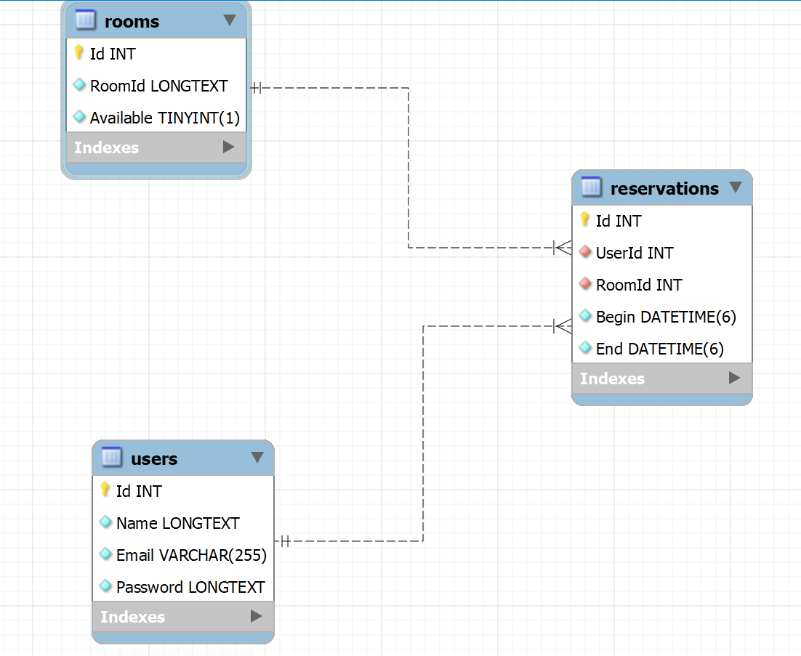
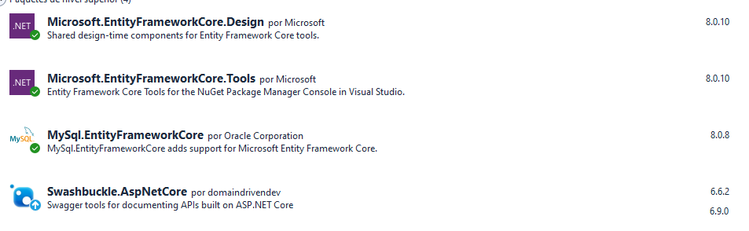
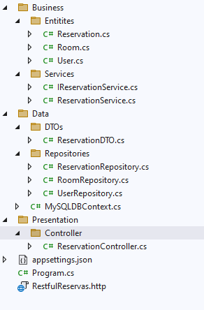
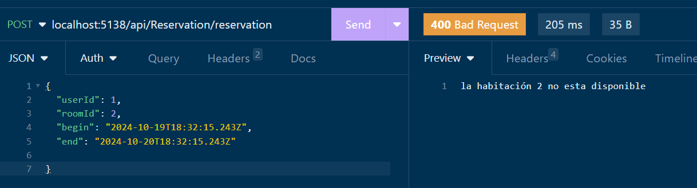
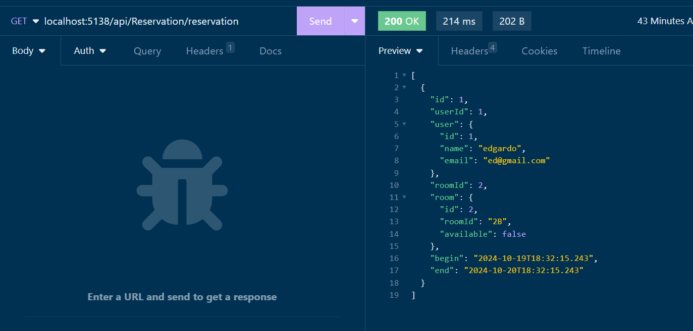

# Proyectos Clean Architecture [indice](README.md)

- Este es una aplicación Web  RestFull que nos permite hacer reservaciones de hotel. 
El diagrama de relación es el siguiente: 
<br>




# Dependencias usadas

<br>




# Estructura del proyecto 
> Nota: Se muestra en el mismo orden que se debe de desarrollar. 
1. El contenido de la carpeta Entities
2. La clase MySQLDBContext
3. Se añade el contexto de la base de datos en Program.cs
4. Se crean los repositorios de cada tabla.
5. Se añaden las dependencias de  cada Repositorio en Program.cs
6. Se crea ReservationDTO
7. Se crea el contenido de Services
8. Se inyecta el servicio en Program.cs
9. Se crea el controlador
10. Antes de probar se sugiere añadir datos en MySQL en la tabla users y rooms. 

```sql
insert into users (name, email, password) values("edgardo", "ed@gmail.com", "12345");

insert into rooms (roomid, available) values("1A", false);
```

<br>



# Código

- [**Program.cs**](#programcs-return)

- [**Business**](#business-return)
    - [**Entities**](#entities)
        - [**Reservation.cs**](#reservationcs)
        - [**Room.cs**](#roomcs)
        - [**User.cs**](#usercs)
    - [ **Services**](#servicescs-return)
        - [**IReservationService.cs**](#ireservationservicecs)
        - [**ReservationService.cs**](#reservationservicecs)
-  [**Data**](#data-return)
    - [**DTOs**](#dtos)
        - [**ReservationDTO.cs**](#reservationdtocs)
    - [**Repositories**](#repositories)
        - [**ReservationRepository.cs**](#reservationrepositorycs)
        - [**RoomRepository**](#roomrepositorycs)
        - [**UserRepository**](#userrepositorycs)
    - [**MySQLDBContext.cs**](#mysqldbcontextcs)


- [**Presentation**](#presentation-return)
    - [**Controller**](#controller)
        - [**ReservationController.cs**](#reservationcontrollercs)


## Program.cs [return](#código)
Dentro de esta clase se inyectan las dependencias de las siguiente forma.

<br>

```c#
using Microsoft.EntityFrameworkCore;
using RestfulReservas.Business.Services;
using RestfulReservas.Data;
using RestfulReservas.Data.Repositories;

var builder = WebApplication.CreateBuilder(args);

// Add services to the container.

builder.Services.AddControllers();
// Learn more about configuring Swagger/OpenAPI at https://aka.ms/aspnetcore/swashbuckle
builder.Services.AddEndpointsApiExplorer();
builder.Services.AddSwaggerGen();

/*Inyección Contexto de base de datos*/
builder.Services.AddDbContext<MySQLDBContext>(builder => {
    builder.UseMySQL("server=localhost;port=3306;user=root;password=1234;database=reservas");
    
    });

/*Inyección de Repositorios*/
builder.Services.AddScoped<ReservationRepository>();
builder.Services.AddScoped<UserRepository>();
builder.Services.AddScoped<RoomRepository>();

/*Inyección Servicios*/
builder.Services.AddScoped<IReservationService, ReservationService>();


var app = builder.Build();

// Configure the HTTP request pipeline.
if (app.Environment.IsDevelopment())
{
    app.UseSwagger();
    app.UseSwaggerUI();
}

app.UseAuthorization();

app.MapControllers();

app.Run();
```

# Business [return](#código)
## Entities  [return](#código)
Aqui se encuentran las clases que representan el model de base de datos.
### Reservation.cs
```c#
namespace RestfulReservas.Business.Entitites
{
    public class Reservation
    {

        public int Id { get; set; }
        public int UserId { get; set; }
        public User? User { get; set; }
        public int RoomId { get; set; }
        public Room? Room { get; set; }
        public DateTime Begin { get; set; }
        public DateTime End { get; set; }

        public Reservation(int userId, int roomId, DateTime begin, DateTime end)
        {
            UserId = userId;
            RoomId = roomId;
            Begin = begin;
            End = end;
        }

        public Reservation()
        {
        }
    }
}
```


### Room.cs
```c#
using System.Text.Json.Serialization;

namespace RestfulReservas.Business.Entitites
{
    public class Room
    {
        public int Id { get; set; }
        public string RoomId { get; set; }
        public bool Available { get; set; }

        [JsonIgnore]
        public ICollection<Reservation> Reservations { get; set; }

    }
}
```


### User.cs
```c#
using System.Text.Json.Serialization;

namespace RestfulReservas.Business.Entitites
{
    public class User
    {
        public int Id { get; set; }
        public string Name { get; set; }  
        public string Email { get; set; }

        [JsonIgnore]
        public string Password { get; set; }

        public User(int id, string name, string email, string password)
        {
            Id = id;
            Name = name;
            Email = email;
            Password = password;
        }


    }
}
```

## Services.cs [return](#código)


### IReservationService.cs
```c#
using RestfulReservas.Business.Entitites;
using RestfulReservas.Data.DTOs;

namespace RestfulReservas.Business.Services
{
    public interface IReservationService
    {
        public List<Reservation> GetAll();

        public int Create(ReservationDTO dto);

        public List<Room> GetAvailableRooms();
    }
}
```

### ReservationService.cs
```c#
using Microsoft.JSInterop.Infrastructure;
using RestfulReservas.Business.Entitites;
using RestfulReservas.Data.DTOs;
using RestfulReservas.Data.Repositories;

namespace RestfulReservas.Business.Services
{
    public class ReservationService : IReservationService
    {
        private readonly UserRepository _userRepo;
        private readonly ReservationRepository _reservationRepository;
        private readonly RoomRepository _roomRepository;

        public ReservationService(UserRepository userRepository, 
            ReservationRepository reservationRepository, 
            RoomRepository roomRepository) { 
            _userRepo = userRepository;
            _reservationRepository = reservationRepository;
            _roomRepository = roomRepository;
        }

        public int Create(ReservationDTO dto)
        {
            //Search user
            var user = _userRepo.GetById(dto.UserId);
            if (user == null)
                throw new Exception($"El usuario {dto.UserId} no existe");

            //Search room
            var room =_roomRepository.GetById(dto.RoomId);
            if (room.RoomId ==null)
                throw new Exception($"El room {dto.RoomId} no existe");

            if (!room.Available)
                throw new Exception($"la habitación {dto.RoomId} no esta disponible");

            //Create reservation
            Reservation reservation=new() { 
                UserId=user.Id,
                RoomId=room.Id,
                Begin=dto.Begin,
                End=dto.End,
            };

            int result=_reservationRepository.Insert(reservation);

            //Update room not available
            room.Available = false;

            _roomRepository.Update(room);

            return result;


        }

        public List<Reservation> GetAll()
        {
            return _reservationRepository.GetAll();
        }


        public List<Room> GetAvailableRooms() {
            return _roomRepository.GetAvailable();
        }

    }
}
```

# Data [return](#código)
## DTO's
### ReservationDTO.cs

```c#
namespace RestfulReservas.Data.DTOs
{
    /*Esta clase nos sirve para transportar datos
     entre el controlador y bussiness*/
    public class ReservationDTO
    {
        public int UserId{ get; set; }
        public int RoomId { get; set; }
        public DateTime Begin { get; set; }
        public DateTime End { get; set; }

        public override string ToString() => 
            $"DTO [{UserId}, {RoomId}, {Begin}, {End}]";
        

    }
}
```
## Repositories
### ReservationRepository.cs
```c#
using Microsoft.EntityFrameworkCore;
using RestfulReservas.Business.Entitites;


namespace RestfulReservas.Data.Repositories
{
    public class ReservationRepository
    {
        private readonly MySQLDBContext _dbcontext;

        public ReservationRepository(MySQLDBContext dbcontext) {
            _dbcontext = dbcontext;
            _dbcontext.Database.EnsureCreated();// Se asegura que las tablas se hayan creado
        }


        public Reservation GetById(int id) {
            return _dbcontext.Reservations.Find(id)??new Reservation();
        }

        public int Insert(Reservation reservation) {
            _dbcontext.Reservations.Add(reservation);
            int result=_dbcontext.SaveChanges();
            return result;
        }


        public List<Reservation> GetAll() {
            return _dbcontext.Reservations.Include(r => r.User)//añadiendo relaciones
                                          .Include(r=>r.Room)//añadiendo relaciones
                                          .ToList();
        
        }
    }
}
```
### UserRepository.cs
```c#
using RestfulReservas.Business.Entitites;

namespace RestfulReservas.Data.Repositories
{
    public class UserRepository
    {
        private readonly MySQLDBContext _dbContext;

        public UserRepository(MySQLDBContext dbContext) { 
            _dbContext=dbContext; 
            _dbContext.Database.EnsureCreated();// Se asegura que las tablas se hayan creado
        }


        public User GetById(int id) {
            var user = _dbContext.Users.Find(id);
            if (user!=null) {
                return user;
            }
            throw null;
        }


        public List<User> FindAll() {
            return _dbContext.Users.ToList();
        }

        public int Save(User user) {
            _dbContext.Users.Add(user);
            int result=_dbContext.SaveChanges();
            return result;
        }

    }
}
```

### RoomRepository.cs
```c#
using RestfulReservas.Business.Entitites;

namespace RestfulReservas.Data.Repositories
{
    public class RoomRepository
    {
        private readonly MySQLDBContext _dbContext;

        public RoomRepository(MySQLDBContext dbContext) {
            _dbContext = dbContext;
            _dbContext.Database.EnsureCreated();// Se asegura que las tablas se hayan creado
        }

        public Room GetById(int id) {
            return _dbContext.Rooms.Find(id)??new Room();
        }

        public int Insert(Room room) {
            _dbContext.Rooms.Add(room);
            int result=_dbContext.SaveChanges();
            return result;
        }

        public int Update(Room room) {
            var roomSearch = _dbContext.Rooms.Find(room.Id);
            if (roomSearch != null)
            {
                _dbContext.Rooms.Update(room);
                int result = _dbContext.SaveChanges();
                return result;
            }

            throw new Exception($"Room {room.RoomId} no existe!!!");
        }

        public List<Room> GetAvailable() {
            return _dbContext.Rooms.Where(t => t.Available).ToList();
        }

    }
}
```


## MySQLDBContext.cs
```c#
using Microsoft.EntityFrameworkCore;
using RestfulReservas.Business.Entitites;

namespace RestfulReservas.Data
{
    public  class MySQLDBContext:DbContext
    {

        public MySQLDBContext() { }
        public MySQLDBContext(DbContextOptions<MySQLDBContext> options):base(options) {
        }


        /*Se inicializan las entidades*/
        public DbSet<User> Users { get; set; }
        public DbSet<Reservation> Reservations { get; set; }
        public DbSet<Room> Rooms { get; set; }

        /*Se inicializa el contexto en Program.cs*/
        protected override void OnConfiguring(DbContextOptionsBuilder optionsBuilder)
        {}

        /*Se configuran las entidades para la base de datos*/

        protected override void OnModelCreating(ModelBuilder modelBuilder)
        {


            /*Configurando los auto increment*/
            modelBuilder.Entity<User>().Property(u => u.Id)
                .ValueGeneratedOnAdd();

            modelBuilder.Entity<Room>().Property(y=>y.Id)
                .ValueGeneratedOnAdd();

            modelBuilder.Entity<Reservation>().Property(u=>u.Id)
                .ValueGeneratedOnAdd();

            /*Constrains*/
            modelBuilder.Entity<User>().HasIndex(u => u.Email).IsUnique();

            modelBuilder.Entity<Room>().HasMany(r => r.Reservations)
                                       .WithOne(h => h.Room)
                                       .HasForeignKey(r=>r.RoomId);

            base.OnModelCreating(modelBuilder);

        }

    }
}
```

# Presentation [return](#código)
## Controller
### ReservationController.cs
```c#
using Microsoft.AspNetCore.Mvc;
using RestfulReservas.Business.Services;
using RestfulReservas.Data.DTOs;
using RestfulReservas.Data.Repositories;

namespace RestfulReservas.Presentation.Controller
{
    [Route("api/[controller]")]
    [ApiController]
    public class ReservationController : ControllerBase
    {
        private readonly IReservationService _reservationService;
        private readonly UserRepository _userRepository;

        public ReservationController(IReservationService reservationService,
            UserRepository userRepository)
        {
            _reservationService = reservationService;
            _userRepository = userRepository;
        }


        [HttpGet("users")]
        public IActionResult GetUser()
        {
            var users = _userRepository.FindAll();
            return Ok(users);
        }

        [HttpPost("reservation")]
        public IActionResult CreateReservation([FromBody] ReservationDTO dto)
        {
            try
            {
                Console.WriteLine($"input {dto}");
                int result = _reservationService.Create(dto);
                return result > 0 ? Ok("Reservacion creada") : BadRequest("algo sucedio");

            }
            catch (Exception ex)
            {
                Console.WriteLine(ex.Message);
                return BadRequest(ex.Message);
            }

        }

        [HttpGet("reservation")]
        public IActionResult GetReservations()
        {
            var reservations = _reservationService.GetAll();
            return Ok(reservations);
        }


        [HttpGet("rooms")]
        public IActionResult GetAvailableRooms()
        {
            var rooms = _reservationService.GetAvailableRooms();
            return Ok(rooms);

        }

    }
}
```

# Consumos



