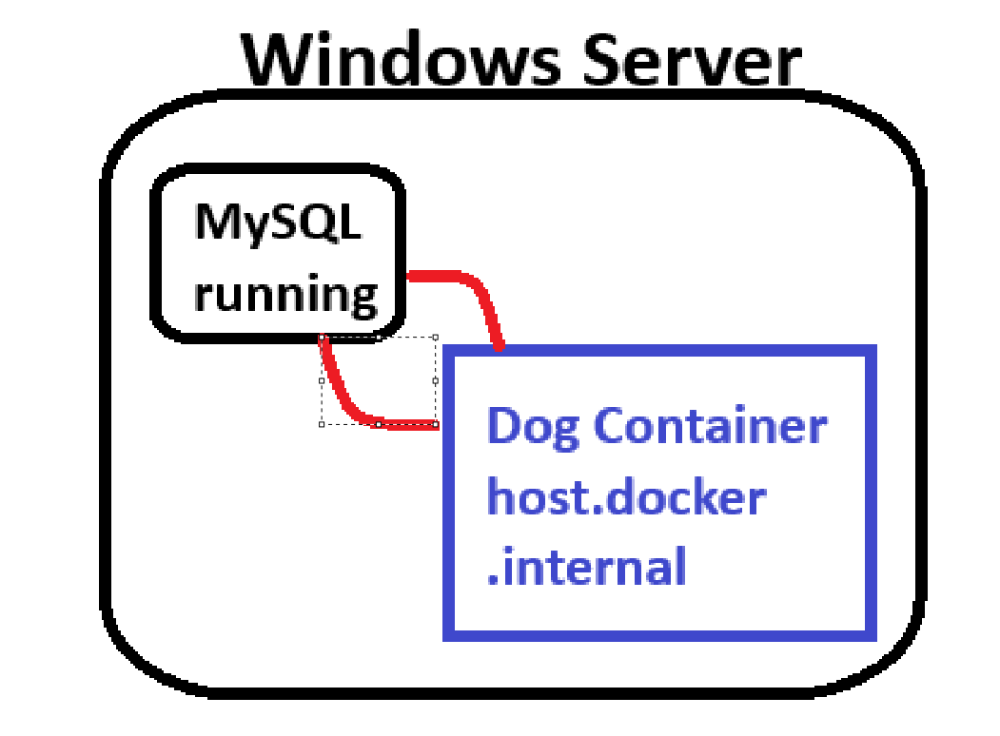
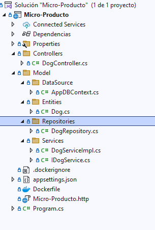
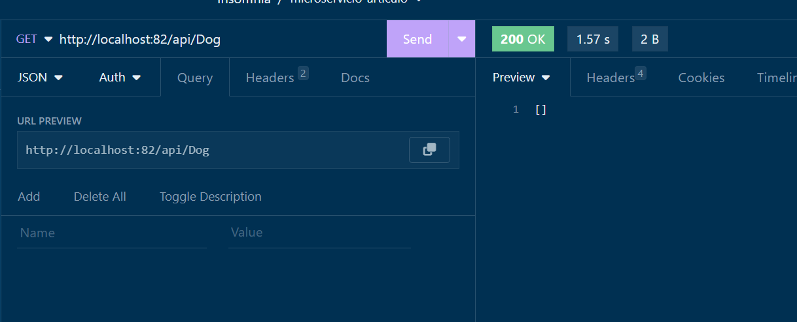

# Microservicio Dog [indice](README.md)
En este proyecto nuestro objetivo es crear un microservicio que nos permita obtener información de perros
Desplegado en un contenedor

- **Crear un proyecto RESTFUL**
- **Seleccionar compatibilidad con Docker**

# Diagrama aplicación



## Estructura del proyecto
<br>



## Para este proyecto necesitamos separarlo en 2 fases

- ## [Codificación proyecto](#código-proyecto)
- ## [Creación contenedor Docker](#crear-contenedor)

## [Código proyecto](#codificación-proyecto)

## Código

- [**Program.cs**](#programcs)
- [**appsettings.json**](#appsettingsjson)
- [**Controllers**](#controllers)
    - [**DogController.cs**](#dogcontrollercs)
- [**Model**](#model)
    - [**DataSource**](#datasource)
        - [**AppDBContext.cs**](#appdbcontextcs)
    - [**Entities**](#entities)
        - [**Dog.cs**](#dogcs)
    - [**Repositories**](#repositories)
        - [**DogRepository.cs**](#dogrepositorycs)
    - [**Services**](#services)
        - [**IDogService**](#idogservicecs)
        - [**DogServiceImpl**](#dogserviceimplcs)

<br><br>

# [Program.cs](#código)

```c#
using Micro_Producto.Model.DataSource;
using Micro_Producto.Model.Repositories;
using Micro_Producto.Model.Services;
using Microsoft.EntityFrameworkCore;


var builder = WebApplication.CreateBuilder(args);

// Add services to the container.

builder.Services.AddControllers();
// Learn more about configuring Swagger/OpenAPI at https://aka.ms/aspnetcore/swashbuckle
builder.Services.AddEndpointsApiExplorer();
builder.Services.AddSwaggerGen();


var ConnectionString = Environment.GetEnvironmentVariable("CONN_STR");

/*Add Db Context con variable de ambiente y cadena de conexión*/
builder.Services.AddDbContext<AppDBContext>(
    obj => {
        obj.UseMySQL(
            ConnectionString??
            builder.Configuration.GetConnectionString("DefaultConnection")
            ??"");
          }
    );


/*Injection Services*/
builder.Services.AddScoped<DogRepository>();

builder.Services.AddScoped<IDogService, DogServiceImpl>();


var app = builder.Build();

// Configure the HTTP request pipeline.
if (app.Environment.IsDevelopment())
{
    app.UseSwagger();
    app.UseSwaggerUI();
}

app.UseAuthorization();

app.MapControllers();

app.Run();
```

# [appsettings.json](#código)
```json
{
  "Logging": {
    "LogLevel": {
      "Default": "Information",
      "Microsoft.AspNetCore": "Warning"
    }
  },
  "AllowedHosts": "*",
  "ConnectionStrings": {
    "DefaultConnection": "server=localhost;port=3306;user=root;password=1234;database=microservice1"
  }
}
```

# [Controllers](#código)
##  [DogController.cs](#código)

```c#
using Micro_Producto.Model.Entities;
using Micro_Producto.Model.Services;
using Microsoft.AspNetCore.Mvc;

namespace Micro_Producto.Controllers
{
    [Route("api/[controller]")]
    [ApiController]
    public class DogController : ControllerBase
    {
        private readonly IDogService _service;

        public DogController(IDogService service)
        {
            _service = service;
        }

        [HttpPost]
        public IActionResult Insert([FromBody] Dog dog) {
            var result = _service.Insert(dog);

            if (result > 0)
                return Created();
            
            return BadRequest(result);
        }

        [HttpGet]
        public IActionResult GetDogs() { 
            var data=_service.GetAll();

            return Ok(data);
        }

        [HttpGet("id")]
        public IActionResult GetById([FromQuery] int id)
        {
            
            try {
                var data = _service.FindById(id);
                return Ok(data);
            }
            catch (Exception ex) { 
                Console.WriteLine(ex.Message);
                return BadRequest(ex.Message);
            }
        }

        [HttpDelete]
        public IActionResult Delete([FromQuery] int id) {
            try
            {
                var data = _service.Delete(id);
                
                return Ok($"Eliminado ${data>0}");
            }
            catch (Exception ex) {
                return NotFound(ex.Message);
            }
        }


    }
}
```

# [Model](#código)
## [Datasource](#código)
### [AppDbContext.cs](#código)

```c#
using Micro_Producto.Model.Entities;
using Microsoft.EntityFrameworkCore;

namespace Micro_Producto.Model.DataSource
{
    public class AppDBContext : DbContext
    {
        public AppDBContext() { }
        public AppDBContext(DbContextOptions<AppDBContext> options):base(options) { }


        /*Se inicializan las entidades*/
        public DbSet<Dog> Dogs { get; set; }


        /*Se inicializa el context en Program.cs*/
        protected override void OnConfiguring(DbContextOptionsBuilder optionsBuilder)
        {}

        /*Se configuran las entidades*/
        protected override void OnModelCreating(ModelBuilder modelBuilder)
        {

            /*Configurando los auto_increment*/
            modelBuilder.Entity<Dog>().Property(u=>u.Id)
                .ValueGeneratedOnAdd();

            base.OnModelCreating(modelBuilder);
        }


    }
}
```

## [Entities](#código)
### [Dog.cs](#código)

```c#
namespace Micro_Producto.Model.Entities
{
    public class Dog
    {
        public int Id { get; set; }
        public string? Name { get; set; }
        public string? Description { get; set; }
        public int MaxAge { get; set; }
        public string? UrlImage { get; set; }
    }
}
```

## [Repositories](#código)
### [DogRepository.cs](#código)

```c#
using Micro_Producto.Model.DataSource;
using Micro_Producto.Model.Entities;

namespace Micro_Producto.Model.Repositories
{
    public class DogRepository
    {
        private readonly AppDBContext _dbContext;
        public DogRepository(AppDBContext dBContext) {
            _dbContext = dBContext;
            _dbContext.Database.EnsureCreated();   
        }

        public int Insert(Dog dog) {
            _dbContext.Dogs.Add(dog);
            return _dbContext.SaveChanges();
        }

        public List<Dog> GetAll() { 
           return _dbContext.Dogs.ToList();
        }

        public Dog FindById(int id) {
            var search=_dbContext.Dogs.Find(id);
            return search??throw new Exception($"Dog with id {id} doesn't exists");
        }

        public int DeleteById(int id) { 
            var dog= _dbContext.Dogs.Find(id);
            if (dog!=null) { 
                var dogR= _dbContext.Dogs.Remove(dog);
                _dbContext.SaveChanges();
                return dogR != null ? 1 : 0;
            }
            throw new Exception($"no existe el perro");
        }
    }
}
```

## [Services](#código)
### [IDogService.cs](#código)

```c#
using Micro_Producto.Model.Entities;

namespace Micro_Producto.Model.Services
{
    public interface IDogService
    {
        List<Dog> GetAll();
        int Insert(Dog dog);
        int Delete(int id);
        Dog FindById(int id);

    }
}

```


### [DogServiceImpl.cs](#código)

```c#
using Micro_Producto.Model.Entities;
using Micro_Producto.Model.Repositories;

namespace Micro_Producto.Model.Services
{
    public class DogServiceImpl : IDogService
    {
        private readonly DogRepository _dogRepository;

        public DogServiceImpl(DogRepository dogRepository) { 
            _dogRepository = dogRepository;
        }


        public int Delete(int id)
        {
           return _dogRepository.DeleteById(id);
        }

        public Dog FindById(int id)
        {
            return _dogRepository.FindById(id);
        }

        public List<Dog> GetAll()
        {
            return _dogRepository.GetAll();
        }

        public int Insert(Dog dog)
        {
            return _dogRepository.Insert(dog);
        }
    }
}

```


# [Crear contenedor](#creación-contenedor-docker)

El Dockerfile generado por .net genera algunos confictos en las rutas, así que lo resolveremos módificando las siguientes líneas. 

```Dockerfile
# Esta fase se usa cuando se ejecuta desde VS en modo rápido (valor predeterminado para la configuración de depuración)
FROM mcr.microsoft.com/dotnet/aspnet:8.0 AS base
USER app
WORKDIR /app
EXPOSE 8080


# Esta fase se usa para compilar el proyecto de servicio
FROM mcr.microsoft.com/dotnet/sdk:8.0 AS build
ARG BUILD_CONFIGURATION=Release
WORKDIR /src/Micro-Product #correjido
COPY ["Micro-Producto.csproj", "./Micro-Producto.csproj"] #Correjido
RUN dotnet restore "./Micro-Producto.csproj" #correjido
COPY . .
#WORKDIR "/src/Micro-Producto" #eliminado
RUN dotnet build "./Micro-Producto.csproj" -c $BUILD_CONFIGURATION -o /app/build

# Esta fase se usa para publicar el proyecto de servicio que se copiará en la fase final.
FROM build AS publish
ARG BUILD_CONFIGURATION=Release
RUN dotnet publish "./Micro-Producto.csproj" -c $BUILD_CONFIGURATION -o /app/publish /p:UseAppHost=false

# Esta fase se usa en producción o cuando se ejecuta desde VS en modo normal (valor predeterminado cuando no se usa la configuración de depuración)
FROM base AS final
WORKDIR /app
COPY --from=publish /app/publish .
ENTRYPOINT ["dotnet", "Micro-Producto.dll"]
```


## Construir imagen con el siguiente comando estando en la carpeta donde esta el Dockerfile

```bash
docker build -t dog:v1 .
```

## Construir contenedor añadiendo la variable de ambiente 

```bash
docker run  -p 82:8080 --name dogmicro -e CONN_STR="server=host.docker.internal;port=3306;user=root;password=1234;database=microservice1" -d dog:v1
```

## Validar que el contenedor este levantado




