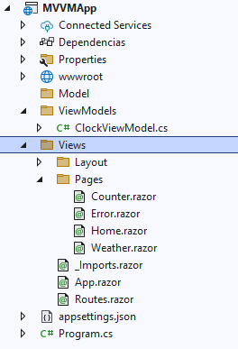

# Herramientas y Tecnologías [indice](README.md)

## Proyecto MVVM
Al final de este proyecto se espera una salida similar a la siguiente:
<br>


En este proyecto no necesita dependencias. Sólo se necesita crear el siguiente tipo de proyecto: 
<br>


# Estructura del proyecto


# Código
> Por defecto al usar este tipo de proyecto la carpeta Views la llama Componentes (la podemos dejar así no hay problema )

- [**Program.cs**](#programcs-return)

- [**Model**](#model-return)
- [**ViewModels**](#viewmodels-return)
    - [**ClockViewModel.cs**](#clockviewmodelcs)
- [**Views|Components**]()
    - [**Counter.razor**]()


# Program.cs [return](#código)

```c#
using MVVMApp.ViewModels;
using MVVMApp.Views;

var builder = WebApplication.CreateBuilder(args);

// Add services to the container.
builder.Services.AddRazorComponents()
    .AddInteractiveServerComponents();


/*Inyection ViewModel*/
builder.Services.AddSingleton<ClockViewModel>();

var app = builder.Build();

// Configure the HTTP request pipeline.
if (!app.Environment.IsDevelopment())
{
    app.UseExceptionHandler("/Error", createScopeForErrors: true);
}

app.UseStaticFiles();
app.UseAntiforgery();

app.MapRazorComponents<App>()
    .AddInteractiveServerRenderMode();

app.Run();
```


# Model [return](#código)
> Para esta sección esta vacio no es necesario agregar algo, aunque si lo requieres podemos añadir toda la parte del modelo. 


# ViewModels [return](#código)

## ClockViewModel.cs

```c#
using System.Timers;
namespace MVVMApp.ViewModels
{


    public class ClockViewModel
    {
        public string Name { get; set; } = "";

        public System.Timers.Timer _timer { get; set; }
        public string CurrentTime { get; set; }

        public ClockViewModel() {
            _timer = new System.Timers.Timer(1000);
            _timer.Elapsed += Update;
            _timer.Start();
            CurrentTime = DateTime.Now.ToString("HH:mm:ss");
        }

        public void Update(object sender, ElapsedEventArgs args) {
            CurrentTime = DateTime.Now.ToString("HH:mm:ss");
        }

        public void Dispose() {
            _timer?.Dispose();
        }

    }
}
```

# Views [return](#código)
> En esta carpta se puede llamar componentes no pasa nada. A pesar que tiene varias vistas reactivas, sólo modificamos **Counter**

## Counter.razor

```c#
@using MVVMApp.ViewModels;
@page "/counter"
@rendermode InteractiveServer
@inject ClockViewModel ViewModel;

<PageTitle>Counter</PageTitle>


<h1>Reloj Digital con MVVM</h1>
<label>Nombre: </label>
<input @bind-value="ViewModel.Name"/>

<h2>@ViewModel.Name</h2>

<h2>@ViewModel.CurrentTime</h2>

@code{


    protected override void OnInitialized()
    {

        var timer = new System.Threading.Timer(t=>
        {
            InvokeAsync(() => StateHasChanged());    
        },null, 0 , 1000);
    }
}
```


