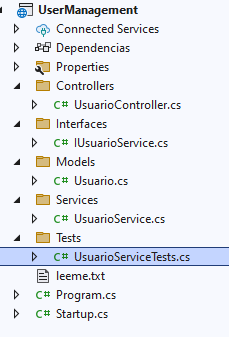

# Testing [indice](README.md)

Para este tema usaremos un proyecto casi completo este proyecto lo encontraremos en [Proyectos/Herramientas](./proyectos/Herramientas/)

Ahora debemos de compartir el proyecto de Testing a los alumnos

# Estructura del proyecto


# Código
- [**UsuarioServiceTest.cs**](#usuarioservicetestcs-return)

- [**Ejecución Pruebas Unitarias**]()


# UsuarioServiceTest.cs [return](#código)


```c#
using Xunit;
using UserManagement.Models;
using UserManagement.Services;

namespace UserManagement.Tests
{
    public class UsuarioServiceTests
    {
        [Fact]
        public void CrearUsuario_UsuarioDeberiaSerAgregado()
        {
            // Arrange
            var usuarioService = new UsuarioService();
            var usuario = new Usuario(1, "Rodrigo Silva", "rodrigo@correo.com");

            // Act
            usuarioService.CrearUsuario(usuario);
            var resultado = usuarioService.ObtenerUsuarioPorId(1);

            // Assert
            Assert.NotNull(resultado);
            Assert.Equal("Rodrigo Silva", resultado!.Nombre);
            Assert.Equal("rodrigo@correo.com", resultado.Email);
        }

        [Fact]
        public void EliminarUsuario_UsuarioDeberiaSerEliminado()
        {
            // Arrange
            var usuarioService = new UsuarioService();
            var usuario = new Usuario(1, "Rodrigo Silva", "rodrigo@correo.com");
            usuarioService.CrearUsuario(usuario); // Aseguramos que el usuario se haya agregado

            // Act
            usuarioService.EliminarUsuario(1);  // Ahora lo eliminamos
            var resultado = usuarioService.ObtenerUsuarioPorId(1);

            // Assert
            Assert.Null(resultado);  // Verificamos que el usuario ya no exista
        }
    }
}
```


# Ejecutar Pruebas

## Usar los siguientes comandos:
- **dotnet restore** : Usado para descargar los paquetes nuget
- **dotnet test**: Usado para ejecutar las pruebas unitarias

