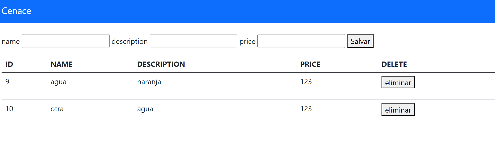
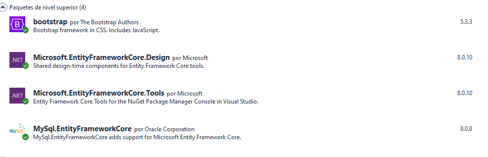
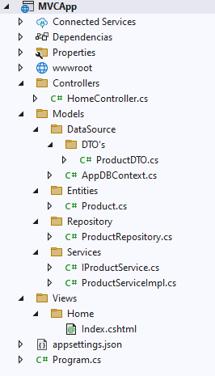

# Herramientas y tecnologías para Arquitectura Limpia [indice](README.md)

# Proyecto MVC 
Este proyecto nos permite registrar productos y eliminarlos de la base de datos.

## Resultado final



<br>

# Dependencias


# Estructura del proyecto



# Código

- [**Program.cs**](#programcs-return)

- [**Controllers**](#controllers-return)
    - [**HomeController.cs**]()
- [**Models**](#models-return)
    - [**Datasource**](#datasource)
        - [**DTO's**](#dtos)
            - [**ProductDTO.cs**](#productdtocs)
        - [**AppDBContext.cs**](#appdbcontextcs)
    - [**Entities**](#entities)
        - [**Product.cs**](#productcs)
    - [**Repository**](#repository)
        - [**ProductRepository.cs**](#productrepositorycs)
    - [**Services**](#services)
        - [**IProductService.cs**](#iproductservicecs)
        - [**ProductServiceImpl**](#productserviceimplcs)
- [**Views**](#views-return)
    - [**Home**](#home)
        - [**Index.cshtml**](#indexcshtml)


# Program.cs [return](#código)
```c#
using Microsoft.EntityFrameworkCore;
using MVCApp.Models.DataSource;
using MVCApp.Models.Repository;
using MVCApp.Models.Services;

var builder = WebApplication.CreateBuilder(args);

// Add services to the container.
builder.Services.AddRazorPages();

/*Add Context DB Injection*/
builder.Services.AddDbContext<AppDBContext>(
    builder=>builder.UseMySQL("server=localhost;port=3306;user=root;password=1234;database=mvc"));


/*Add Repositories*/
builder.Services.AddScoped<ProductRepository>();

/*Add Services*/
builder.Services.AddScoped<IProductService, ProductServiceImpl>();


var app = builder.Build();

// Configure the HTTP request pipeline.
if (!app.Environment.IsDevelopment())
{
    app.UseExceptionHandler("/Error");
}
app.UseStaticFiles();

app.UseRouting();

app.UseAuthorization();

app.MapRazorPages();

app.MapControllerRoute(
    name: "default",
    pattern: "{controller=Home}/{action=Index}/{id?}"
    );

app.Run();

```


# Controllers [return](#código)
## HomeController.cs

```c#
using Microsoft.AspNetCore.Mvc;
using MVCApp.Models.DataSource.DTO_s;
using MVCApp.Models.Services;

namespace MVCApp.Controllers
{
    public class HomeController : Controller
    {

        private readonly IProductService _service;

        public HomeController(IProductService service) {
            _service = service; 
        }


        
        public IActionResult Index()
        {
            ViewData["Products"] = _service.GetAll();
            return View();
        }

        [HttpPost]
        public IActionResult Save([Bind("Name", "Description", "price")] ProductDTO product) {
            int result=_service.Insert(new Models.Entities.Product()
            {
                Name = product.Name,
                Description = product.Description,
                price = product.price
            });

            return RedirectToAction("Index");
        }


        public IActionResult Delete([FromQuery] int id)
        {
           int result=_service.Delete(id);
           return RedirectToAction("Index");
        }

    }  
}
```
<br><br>

# Models [return](#código)
## Datasource
### DTO's
#### **ProductDTO.cs**

```c#
namespace MVCApp.Models.DataSource.DTO_s
{
    public class ProductDTO
    {
        public int Id { get; set; }
        public string Name { get; set; }
        public string Description { get; set; }
        public double price { get; set; }
    }
}
```

### AppDBContext.cs

```c#
using Microsoft.EntityFrameworkCore;
using MVCApp.Models.Entities;


namespace MVCApp.Models.DataSource
{
    public class AppDBContext:DbContext
    {
        public AppDBContext() { }
        public AppDBContext(DbContextOptions<AppDBContext> options):base(options) { }

        /*Inicializamos las entidades*/
        public DbSet<Product> Products { get; set; }

        /*Añadimos el método para crear el contexto aunque se inyecta  en Program.cs*/
        protected override void OnConfiguring(DbContextOptionsBuilder optionsBuilder)
        {}


        /*Se configura las entidades*/
        protected override void OnModelCreating(ModelBuilder modelBuilder)
        {
            /*Configuramos las entidades*/
            modelBuilder.Entity<Product>().Property(u => u.Id);


            base.OnModelCreating(modelBuilder);
        }

    }
}
```


## Entities
### Product.cs

```c#
namespace MVCApp.Models.Entities
{
    public class Product
    {
        public int Id { get; set; }
        public string Name { get; set; }
        public string Description { get; set; }
        public double price { get; set; }
    }
}
```

## Repository
## ProductRepository.cs

```c#
using MVCApp.Models.DataSource;
using MVCApp.Models.Entities;

namespace MVCApp.Models.Repository
{
    public class ProductRepository
    {
        private readonly AppDBContext _dbContext;

        public ProductRepository(AppDBContext dBContext) {
            _dbContext = dBContext;
            _dbContext.Database.EnsureCreated();
        }


        public int Insert(Product pr) {
            _dbContext.Add(pr);
            int result = _dbContext.SaveChanges();
            return result;
        }


        public int Delete(int id) {
            var product = _dbContext.Products.Find(id);
            if (product != null) {
                _dbContext.Products.Remove(product);
                _dbContext.SaveChanges();
                return 1;
            }
            return 0;
        }

        public List<Product> GetAll(){
            return _dbContext.Products.ToList();
        }

        public Product FindById(int id) { 
            var product=_dbContext.Products.Find(id);
            if (product != null) { 
                return product;
            }
            throw new Exception($"No existe product {id}");
        }


    }
}
```

## Services
### IProductService.cs

```c#
using MVCApp.Models.Entities;

namespace MVCApp.Models.Services
{
    public interface IProductService
    {
        int Insert(Product pr);
        Product FindById(int id);
        List<Product> GetAll();
        int Delete(int id);

    }
}
```

### ProductServiceImpl.cs

```c#
using MVCApp.Models.Entities;
using MVCApp.Models.Repository;

namespace MVCApp.Models.Services
{
    public class ProductServiceImpl : IProductService
    {
        private readonly ProductRepository _repository;

        public ProductServiceImpl(ProductRepository repository) { 
            _repository = repository;
        }

        public int Delete(int id)
        {
            return _repository.Delete(id);
        }

        public Product FindById(int id)
        {
            return _repository.FindById(id);
        }

        public List<Product> GetAll()
        {
            return _repository.GetAll();
        }

        public int Insert(Product pr)
        {
            return _repository.Insert(pr);
        }
    }
}

```

---
<br><br>

# Views [return](#código)
## Home
### Index.cshtml

```html
@using MVCApp.Models.Entities
@*
    For more information on enabling MVC for empty projects, visit https://go.microsoft.com/fwlink/?LinkID=397860
*@
@{
    
}
<link rel="stylesheet" href="~/lib/bootstrap/dist/css/bootstrap.min.css" />

<nav class="navbar bg-primary">
    <div class="container-fluid">
        <a class="navbar-brand" style="color:azure;">Cenace</a>
    </div>
</nav>

<br />

<!--Sección formulario-->
<div class="container-fluid">
    <form action="/Home/Save" method="post">
        <label>name</label>
        <input name="Name" />

        <label>description</label>
        <input  name="Description" />
        
        <label>price</label>
        <input name="Price" type="number"/>

        <button type="submit">Salvar</button>
    </form>
    
</div>
<!-- Fin Sección formulario-->

<!--Tabla productos-->
<div class="container-fluid">
    <table class="table table-striped-columns">
        <thead>
            <tr>
                <th>ID</th>
                <th>NAME</th>
                <th>DESCRIPTION</th>
                <th>PRICE</th>
                <th>DELETE</th>
            </tr>
        </thead>

        <tbody>
            @foreach (var product in (List<Product>)ViewData["Products"])
            {
                <tr>
                    <td>@product.Id</td>
                    <td>@product.Name</td>
                    <td>@product.Description</td>
                    <td>@product.price</td>
                    <td>
                        <form action="/Home/Delete" method="get">
                            <input type="hidden" name="id" value="@product.Id"/>
                            <button type="submit" action="/Home/Delete">eliminar</button>
                        </form>
                        
                    </td>
                </tr>
            }
            
        </tbody>
    </table>
</div>
<!--Fin tabla productos-->
```

